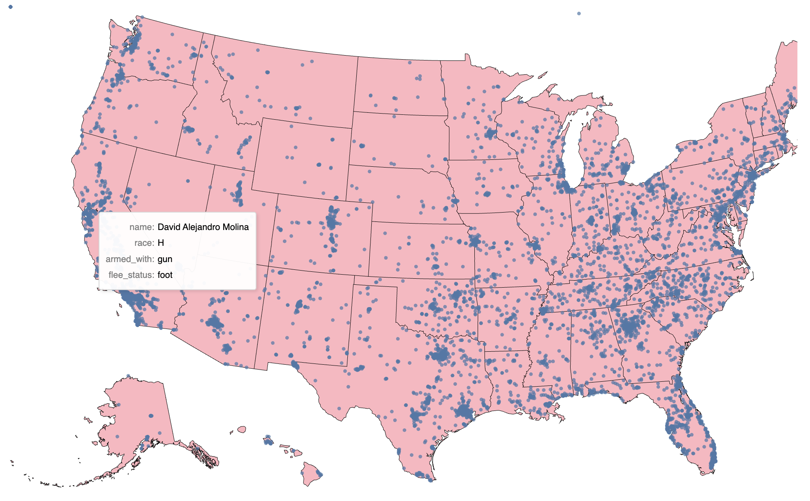

# Beneath The Badge - Poolice Shooting in USA

## Result

## Overview
This project analyzes police shootings in the United States from January 2015 to October 2023, leveraging datasets provided by The Washington Post. The goal is to uncover trends, patterns, and insights into police encounters, focusing on racial demographics, armed status, and geospatial/time-based correlations. Advanced data science techniques such as K-Means clustering, Random Forest modeling, Monte Carlo simulation, and time series analysis are employed to address key questions about fairness, racial bias, and operational patterns in police shootings.

## Datasets
The analysis is based on two datasets from The Washington Post, updated weekly:
1. Shooting Dataset:
- Contains details of police shootings across U.S. cities from 2015 to 2023.
- Features: Name, age, race, gender, armed status, body camera usage, city, state, and police station details.

2. Officers Dataset:
- Includes information about police officers involved in shootings.
- Features: Officer ID, name, position/type, ORI codes, and number of encounters.

## Technology Used
- Python 3.8+
Libraries:
- pandas
- numpy
- matplotlib
- seaborn
- altair
- scikit-learn (for Random Forest and K-Means)

## Methodlogy
- Geospatial Analysis: Visualized shooting locations using Altair's Geo Histogram.
- Time Series Analysis: Identified trends and forecasted patterns in shootings over time.
- K-Means Clustering: Grouped data by race, armed status, city/state, and officer ID to reveal behavioral patterns.
- Monte Carlo Simulation: Estimated age mean and standard deviation for complex data points.
- Random Forest Modeling: Predicted armed status with an accuracy of 0.57. Analyzed racial factors with an accuracy of 0.48.
- Visualization Tools: Used Matplotlib, Seaborn, and Altair for bar graphs, histograms, and geospatial plots.

## Key Findings
1. Annual Trends:
- Peak shootings occurred in 2022 (~1000+ incidents/year).
- 2023 (up to October) showed fewer incidents (~700).
- Consistent annual shootings (~1000) from 2015 to 2021.
2. Racial & Gender Insights:
- White individuals were the most killed (~4000), followed by Black and Hispanic (~1500-2000 each).
- Asian, Native American, and "Other" categories had the fewest incidents (<500).
- Male encounters far outnumbered female encounters.
3. Armed Status:
- Most individuals were armed with guns, followed by knives, unarmed, undetermined vehicles, and blunt objects.
- Random Forest models predicted armed status (accuracy: 0.57) and racial factors (accuracy: 0.48).
4. Clustering:
- K-Means revealed patterns in race, armed status, and geographic distribution.
- Officer encounters clustered by ID showed potential rank/department influence.
5. Geospatial & Temporal Patterns:
- Altair Geo Histograms highlighted city-level correlations between datasets.
- Time series analysis showed consistent shooting patterns with slight variations.

## Future Improvements
- Incorporate real-time data updates from The Washington Post.
- Improve Random Forest accuracy with feature engineering or additional data.
- Expand analysis to include body camera footage impact and socioeconomic factors.

## Contributions
Contributions are welcome! Please fork the repository and submit a pull request.
